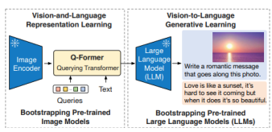
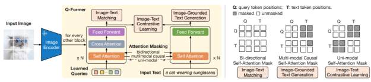

# Blip-2: Bootstrapping Language-Image Pretraining With Frozen Image Encoders And Large Language Models

NotebookMultimodal Foundational Models The paper introduces a novel, compute-efficient approach for vision-language pre-training that uses existing pretrained image encoders and large language models (LLMs). BLIP-2 solves the high computational costs associated with vision-language pre-training by utilizing off-the-shelf pre-trained models and keeping them frozen during the process. To bridge the modality gap between visual and textual data, the authors propose a Querying Transformer
(Q-Former), a lightweight model that enables visual feature extraction from frozen image encoders. This model is pre-trained in following stages:
BLIP-2 leverages frozen pre-trained image and language models, bridging the modality gap through a two-stage Q-Former for representation and generative learning. It achieves state-of-the-art results on vision-language tasks such as visual question answering, image captioning, and image-text retrieval.

Powered by large language models like OPT and FlanT5, BLIP-2 can perform zero-shot image-to-text generation, enabling tasks like visual reasoning and conversational understanding.

BLIP-2 is highly compute-efficient, outperforming Flamingo by 8.7% on zero-shot VQAv2 while using 54 times

 fewer trainable parameters.

The structure of the model to achieve comprehensive text question answering capabilities is as follows:
Image Encoder (Teacher): The frozen image encoder extracts visual features from the input image. By keeping it frozen, BLIP-2 reduces the computational overhead associated with fine-tuning a large model.

Q-Former (Student): The Q-Former is a lightweight transformer module that learns to translate visual information into a format compatible with a language model. It uses **learned queries** to interact with the frozen image features through cross-attention layers, adapting them for downstream language-based tasks. Attention Masks for Multi-Task Learning: The Q-Former employs different attention masks to guide its learning across various tasks:
Bi-directional Mask for **Image-Text Matching**, where both image and text tokens attend to each other.

Multi-modal Causal Mask for **Image-Grounded Text Generation**, where image tokens attend to text tokens causally, allowing sequential generation of descriptive text. Uni-modal Mask for **Image-Text Contrastive Learning**, focusing on aligning image and text representations.

BLIP-2's architecture enables efficient use of pre-trained models, significantly reducing the number of trainable parameters. By relying on frozen image and language models, BLIP-2 effectively aligns vision and language modalities using fewer resources. The model's design allows for zero-shot capabilities in tasks like image captioning and visual question answering, where it demonstrates state-of-the-art performance. This approach outperforms previous models, such as Flamingo, by a substantial margin in zero-shot tasks while using only a fraction of the trainable parameters.

## Strength

By circumventing the need for end-to-end training, BLIP-2 represents a significant advancement in reducing the computational burden traditionally associated with vision-language tasks. Its two-stage pre-training strategy for the Q-Former is particularly innovative, allowing the model to capitalize on both visual learning and language generative capabilities. This approach not only aligns image and text data more effectively but also minimizes the risk of catastrophic forgetting in language models.

## Weakness

The reliance on frozen models, while beneficial for computational efficiency, introduces limitations in adaptability. The model's performance in open-domain tasks that require comprehensive knowledge, such as the OK-VQA dataset, remains slightly behind larger models like Flamingo80B. This performance gap raises questions about the efficiency of using pre-trained models without fine-tuning, especially as models continue to grow and diversify.

## Insights

BLIP-2 also opens up intriguing possibilities for future research. The model's application to zero-shot vision-tolanguage generation demonstrates the potential for versatile multimodal AI systems, particularly those that can interpret images based on textual prompts. Nonetheless, a lingering question is how effectively the model generalizes to tasks requiring higher-order reasoning or contextually nuanced interpretations, as its reliance on frozen LLMs may limit its capacity to adjust dynamically to unfamiliar scenarios.