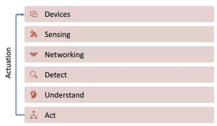

# Guest Lecture 2 - Feedback

Lecture by: Dr. Mark Wilbur Name: Sachin Jadhav UID: **119484524**
The presentation delivered by Dr. Mark Wilbur delves into the intricate world of self-operating systems, exploring how machines can function independently through the integration of AI technologies. His talk navigates through the intersection of robotics and artificial intelligence, examining how these technologies work together to create systems that can interact meaningfully with humans.

During the session, Dr. Wilbur explores essential concepts ranging from the foundational architecture of autonomous systems to cutting-edge developments in combining neural networks with symbolic reasoning. He discusses the revolutionary impact of advanced language processing systems and their role in shaping the landscape of robotics.

## Foundations Of Autonomous Systems

The lecture opens with a foundational explanation of autonomous systems as sophisticated

 machines that operate with varying degrees of independence in the physical world. Dr. Wilbur introduces autonomous systems as sophisticated machines operating independently, using examples from robotics to air traffic management. The discussion centers on how these systems can mirror or complement human cognitive processes. He outlines a six-layer hierarchical framework: starting with physical Devices, moving through Sensing and Networking, to Detection, Understanding, and Acting components. This structure showcases both an "Intelligence stack" for decision-making and the balance between algorithmic automation and human oversight, essential for applications like self-driving vehicles and industrial robotics where safety and complexity demand varying levels of human involvement.

## Building Blocks Of Ai And Autonomous Systems

The lecture progresses systematically through the foundational elements of AI, beginning with basic building blocks and perception mechanisms that enable machines to understand their environment. It then advances into autonomous control and control theory, explaining how systems can regulate themselves while making sequential decisions in complex environments. The discussion evolves into end-to-end learning approaches, followed by reinforcement learning, which demonstrates how AI systems can learn from experience and interaction. Dr. Wilbur then bridges theory with practice by examining current industry perspectives and presents a case study of OpenAI Five, demonstrating real-world applications of these concepts. The exploration of human thinking processes serves as a crucial transition point, setting the stage for the more advanced concept of neuro-symbolic learning. This progression shows how traditional AI approaches lay the groundwork for more sophisticated hybrid systems that combine multiple learning and reasoning methods.

## Bridging Neural Networks And Symbolic Ai

The lecture explores the intersection of human cognition and artificial intelligence, starting with an examination of fast and slow thinking processes and their implementation in symbolic AI systems. Through discussions of vector databases and visual reasoning, it demonstrates how machines can process information in ways that parallel human cognitive patterns. The presentation then advances to neuro-symbolic autonomy and foundation models, illustrating how combining symbolic reasoning with neural networks creates more robust autonomous systems that can better mimic and complement human intelligence.

## Concluding Insights

- Autonomous Systems Applications
- AI demonstrates versatile applications in autonomous operations - Encompasses sensory perception systems - Facilitates complex reasoning processes - Enables sophisticated decision-making capabilities
- Advanced Neural Enhancement
- Neuro-Symbolic learning augments contemporary neural networks - Offers cross-domain adaptability and application
- LLM Integration Benefits
- Provides immediate enhancement to autonomous system capabilities - Creates intuitive interfaces between humans and both virtual/physical systems - Functions as an effective reasoning tool when integrated with appropriate technologies

## Questions

What makes neuro-symbolic learning more data-efficient than traditional neural networks?

How do LLMs serve as a bridge between human instructions and robot actions?