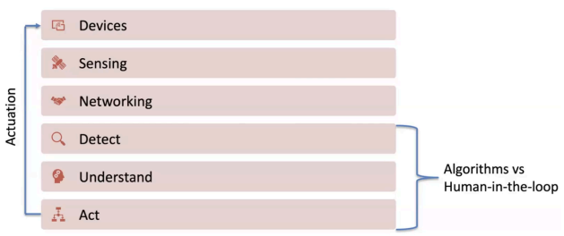
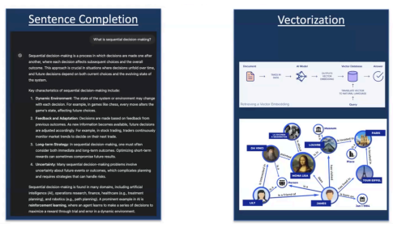

# Hri Guest Lecture Summary 2 Kashif Ansari Uid No: 120278280

# Dr. Mark Wilbur

The lecture by Dr. Mark Wilbur provides a comprehensive overview of autonomous systems, artificial intelligence, and their applications in robotics and human-robot interaction. The lecture covers several key topics, including the design of autonomous systems, neuro-symbolic learning, large language models, and their potential impact on the future of robotics and AI.

# ------------------------------------------------------------------------------------------------------------------------------------------------------------

Autonomous Systems and AI

Screenshot of the picture showing several Autonomous systems fields The lecture begins by introducing autonomous systems as machines operating in the physical world with some degree of autonomy. Examples include robotics, autonomous vehicles, and air traffic management systems. Dr. Wilbur emphasizes the importance of understanding how we as humans think and how robots can be designed to mimic or complement human cognition.

The speaker presents a hierarchical model of  systems, breaking them down into components:
- Device (physical aspect) - Sensing - Networking - Detection - Understanding - Acting This model helps in conceptualizing the different aspects of autonomous systems and where AI can be integrated.

## Evolution Of Ai And Neuro-Symbolic Learning

Dr. Wilbur discusses the evolution of AI from narrow AI to broad AI, with the emergence of large language models like GPT marking a significant shift. He introduces the concept of neuro-symbolic learning, which combines neural networks with symbolic representations to enhance AI systems' reasoning capabilities.

The lecture highlighted the importance of incorporating symbolic knowledge into AI systems, as it can lead to better generalization and faster learning in new domains. This approach is presented as a potential solution to some of the limitations of current AI methods, particularly in robotics and autonomous systems.

Large Language Models and Their **Applications**

Key LLM abilities as shown in the presentation A significant portion of the lecture focuses on large language models (LLMs) and their potential applications in robotics and  systems. Dr. Wilbur explains how LLMs are trained and how they can be used for  tasks, including:
- Sentence completion - Vectorization and document retrieval - Tool usage and function calling The speaker emphasizes the potential of LLMs in improving human-robot interaction by enabling more natural language communication and high-level reasoning.

## Challenges And Future Directions

The lecture concludes by discussing the challenges in implementing these advanced AI techniques in real-world robotics applications. Dr. Wilbur highlights the need for further research in neuro-symbolic learning and the integration of LLMs with physical systems.

A demonstration video is shown, illustrating how a humanoid robot can interpret natural language commands and perform complex tasks using a combination of LLMs and physical intelligence.

## Conclusion

Dr. Wilbur summarizes the key takeaways:
- AI has many use cases in autonomy, including perception, reasoning, and decision-making.

- Neuro-symbolic learning can enhance AI with abstract knowledge. - LLMs provide immediate impact for human-robot interaction and high-level planning. - There are still challenges to be solved for true autonomy and abstraction understanding.

## Questions Based On The Lecture:

#### 1. Integration Of Symbolic Knowledge:

How can we effectively integrate symbolic knowledge with neural networks in practical robotics applications?

#### 2. Llms In Physical Systems:

What are the main challenges in adapting large language models to work with physical robotic systems, and how can these challenges be addressed?

#### 3. Human-Robot Interaction:

How might the incorporation of LLMs and neuro-symbolic learning change the way humans interact with robots in everyday scenarios?

<-------------------------------------------------------------------------------------------------------------------------------------------------------->