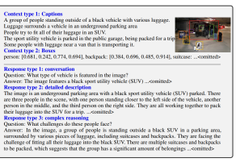
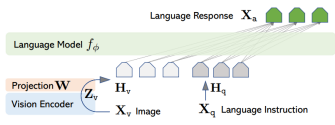

# Visual Instruction Tuning

NotebookMultimodal Foundational Models The research paper introduces an open-source multimodal model that integrates a vision encoder with a language model to perform both visual and language processing. This model, trained on data generated by GPT-4, is designed to follow multimodal instructions and handle complex visual-linguistic tasks, exhibiting capabilities similar to a multimodal GPT-4. By publicly releasing the GPT-4-generated multimodal instruction-following data, the model, and its code, the project, named LLaVA, aims to support further research and experimentation in the field of multimodal instruction tuning.

Instruction tuning in this context is approached by expanding an image-text pair into an instruction-following format. For an image and its associated caption , the model generates a set of questions that instruct the assistant to describe the image content. GPT-4 curates this list of questions, allowing the data to be formatted as follows:
"Human: <STOP> Assistant: <STOP>." While this expanded version is straightforward to construct, it can lack diversity and depth in both instructions and responses.

Xc Xq Xq, Xv Xc To address this limitation, the team leverages a language-only GPT-4 or ChatGPT as a "strong teacher" to generate instruction-following data that incorporates visual content. As GPT-4 cannot process images directly, symbolic representations are used to encode visual features in text form. These representations include captions, which provide various perspectives on the visual scene, and bounding boxes, which localize objects within the scene, encoding both the concept and spatial location of each object. This symbolic representation converts the image into a language model-compatible sequence. Using COCO images, the team generates three types of instruction-following data, based on in-context learning with GPT-4 and a few manually designed seed examples. The first data type involves creating a conversational exchange where the assistant answers questions as if it is visually interpreting the image, covering aspects such as object types, quantities, actions, and relative positions. Only questions with definite answers are considered. The second data type focuses on detailed descriptions of the image, with GPT-4 generating comprehensive responses based on curated lists of questions. The third type emphasizes complex reasoning, requiring step-by-step logical reasoning based on the visual content. These approaches collectively provide a rich multimodal instruction-following dataset, laying the groundwork for

creating visual assistants capable of both basic and sophisticated visual-linguistic tasks.

## Model Architecture

The primary goal is to effectively leverage the capabilities of both the pre-trained LLM and visual

model. The network archtecture is illustrated in Figure 1. We choose Vicuna as our LLM fϕ(·)
parameterized by ϕ, as it has the best instruction following capabilities in language tasks among publicly available checkpoints

## Strengths

The paper is pioneering in using instruction-tuning to teach multimodal models to follow complex visual and language instructions, which is a valuable step toward building general-purpose visual assistants. By leveraging GPT-4 to generate high-quality training data, it overcomes the scarcity of vision-language instruction data without the need for extensive human annotation. The open-source release of data, models, and code promotes accessibility and further research, enabling others to replicate and build on the findings.

## Weaknesses

Since GPT-4 only accepts text input, using symbolic representations like captions and bounding boxes to describe images limits the model's understanding to the descriptive accuracy of these representations. The generated instruction-following data, while helpful, lacks some depth and diversity in instructions and responses, which could reduce the model's flexibility in real-world interactions. Furthermore, fine-tuning on synthetic data may lead to limitations in generalizing to unpredictable or highly nuanced real-world scenarios.

## Insights

This paper demonstrates that large language models can effectively guide the creation of multimodal instruction data, showcasing an innovative use of language-only AI in a visual context. Integrating visual encoders with language decoders offers promising pathways for developing multimodal models that could be applied to practical use cases like visual question answering or real-time image descriptions. The work hints at future directions where multimodal models could eventually match or surpass current benchmarks by combining high-quality synthetic data with realworld visual inputs.