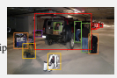
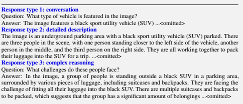
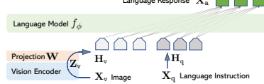
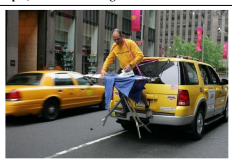
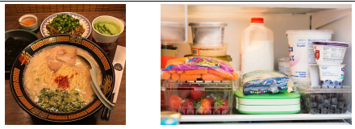

# Visual Instruction Tuning

Haotian Liu1∗, Chunyuan Li2∗, Qingyang Wu3**, Yong Jae Lee**1 1University of Wisconsin–Madison 2Microsoft Research 3Columbia University https://llava-vl.github.io

## Abstract

Instruction tuning large language models (LLMs) using machine-generated instruction-following data has been shown to improve zero-shot capabilities on new tasks, but the idea is less explored in the multimodal field. We present the first attempt to use language-only GPT-4 to generate multimodal language-image instruction-following data. By instruction tuning on such generated data, we introduce LLaVA: Large Language and Vision Assistant, an end-to-end trained large multimodal model that connects a vision encoder and an LLM for generalpurpose visual and language understanding. To facilitate future research on visual instruction following, we construct two evaluation benchmarks with diverse and challenging application-oriented tasks. Our experiments show that LLaVA demonstrates impressive multimodal chat abilities, sometimes exhibiting the behaviors of multimodal GPT-4 on unseen images/instructions, and yields a 85.1% relative score compared with GPT-4 on a synthetic multimodal instruction-following dataset. When fine-tuned on Science QA, the synergy of LLaVA and GPT-4 achieves a new state-of-the-art accuracy of 92.53%. We make GPT-4 generated visual instruction tuning data, our model, and code publicly available.

## 1 Introduction

Humans interact with the world through many channels such as vision and language, as each individual channel has a unique advantage in representing and communicating certain concepts, and thus facilitates a better understanding of the world. One of the core aspirations in artificial intelligence is to develop a general-purpose assistant that can effectively follow multi-modal vision-and-language instructions, aligned with human intent to complete various real-world tasks in the wild [4, 27, 26]. To this end, the community has witnessed an emergent interest in developing language-augmented foundation vision models [27, 16], with strong capabilities in open-world visual understanding such as classification [40, 21, 57, 54, 39], detection [29, 62, 33], segmentation [25, 63, 58] and captioning [50, 28], as well as visual generation and editing [42, 43, 56, 15, 44, 30]. We refer readers to the *Computer Vision in the Wild* reading list for a more up-to-date literature compilation [12]. In this line of work, each task is solved independently by one single large vision model, with the task instruction implicitly considered in the model design. Further, language is only utilized to describe the image content. While this allows language to play an important role in mapping visual signals to language semantics—a common channel for human communication, it leads to models that usually have a fixed interface with limited interactivity and adaptability to the user's instructions. Large language models (LLM), on the other hand, have shown that language can play a wider role: a universal interface for a general-purpose assistant, where various task instructions can be explicitly represented in language and guide the end-to-end trained neural assistant to switch to the task of interest to solve it. For example, the recent success of ChatGPT [35] and GPT-4 [36] have demonstrated the power of aligned LLMs in following human instructions, and have stimulated tremendous interest in developing open-source LLMs. Among them, LLaMA [49] is an opensource LLM that matches the performance of GPT-3. Alpaca [48], Vicuna [9], GPT-4-LLM [38]
utilize various machine-generated high-quality instruction-following samples to improve the LLM's alignment ability, reporting impressive performance compared with proprietary LLMs. Importantly, this line of work is *text-only*.

In this paper, we present *visual instruction-tuning*, the first attempt to extend instruction-tuning to the language-image multimodal space, to pave the way towards building a general-purpose visual assistant. In particular, our paper makes the following contributions:
- *Multimodal instruction-following data*. One key challenge is the lack of vision-language instruction-following data. We present a data reformation perspective and pipeline to convert image-text pairs into an appropriate instruction-following format, using ChatGPT/GPT-4.

- *Large multimodal models*. We develop a large multimodal model (LMM), by connecting the open-set visual encoder of CLIP [40] with the language decoder Vicuna [9], and fine-tuning end-to-end on our generated instructional vision-language data. Our empirical study validates the effectiveness of using generated data for LMM instruction-tuning, and suggests practical tips for building a general-purpose instruction-following visual agent. When ensembled with GPT-4, our approach achieves SoTA on the Science QA [34] multimodal reasoning dataset.

- *Multimodal instruction-following benchmark*. We present LLaVA-Bench with two challenging benchmarks, with a diverse selection of paired images, instructions and detailed annotations.

- *Open-source*. We release the following assets to the public: the generated multimodal instruction data, the codebase, the model checkpoints, and a visual chat demo.

## 2 Related Work

Multimodal Instruction-following Agents. In computer vision, existing works that build instructionfollowing agents can be broadly categorized into two classes: (i) End-to-end trained models, which are separately explored for each specific research topic. For example, the vision-language navigation task [3, 19] and Habitat [47] require the embodied AI agent to follow natural language instructions and take a sequence of actions to complete goals in visual environments. In the image editing domain, given an input image and a written instruction that tells the agent what to do, InstructPix2Pix [6] edits images by following the human instructions. (ii) A system that coordinates various models via LangChain [1] / LLMs [35], such as Visual ChatGPT [53], X-GPT [63], MM-REACT [55], VisProg [18], and ViperGPT [46]. While sharing the same goal in building instruction-following agents, we focus on developing an end-to-end trained language-vision multimodal model for *multiple* tasks.

Instruction Tuning. In the natural language processing (NLP) community, to enable LLMs such as GPT-3 [7], T5 [41], PaLM [10], and OPT [60] to follow natural language instructions and complete real-world tasks, researchers have explored methods for LLM instruction-tuning [37, 52, 51], leading to instruction-tuned counterparts such as InstructGPT [37]/ChatGPT [35], FLAN-T5 [11], FLAN-PaLM [11], and OPT-IML [22], respectively. It turns out that this simple approach can effectively improve the zero- and few-shot generalization abilities of LLMs. It is thus natural to borrow the idea from NLP to computer vision. More broadly, the teacher-student distillation ideas with foundation models have been studied in other topics such as image classification [14]. Flamingo [2] can be viewed as the GPT-3 moment in the multimodal domain, due to its strong performance on zero-shot task transfer and in-context-learning. Other LMMs trained on imagetext pairs include BLIP-2 [28], FROMAGe [24], and KOSMOS-1 [20]. PaLM-E [13] is an LMM for embodied AI. Based on the recent "best" open-source LLM LLaMA, OpenFlamingo [5] and LLaMA-Adapter [59] are open-source efforts that enable LLaMA to use image inputs, paving the way to build open-source multimodal LLMs. While these models present promising task transfer generalization performance, they are not explicitly tuned with vision-language instruction data, and their performance in multimodal tasks usually falls short compared to language-only tasks. In this paper, we aim to fill this gap and study its effectiveness. Finally, note that visual instruction tuning is different from visual prompt tuning [23]: the former aims to improve the model's instructionfollowing abilities, while the latter aims to improve the parameter-efficiency in model adaptation.

## 3 Gpt-Assisted Visual Instruction Data Generation

The community has witnessed a surge in the amount of public multimodal data such as image-text pairs, ranging from CC [8] to LAION [45]. However, when it comes to multimodal instruction-
Context type 1: Captions

 A group of people standing outside of a black vehicle with various luggage. Luggage surrounds a vehicle in an underground parking area People try to fit all of their luggage in an SUV. The sport utility vehicle is parked in the public garage, being packed for a trip Some people with luggage near a van that is transporting it. Context type 2: Boxes person: [0.681, 0.242, 0.774, 0.694], backpack: [0.384, 0.696, 0.485, 0.914], suitcase: ...<omitted>

Table 1: One example to illustrate the instruction-following data. The top block shows the contexts such as captions and boxes used to prompt GPT, and the bottom block shows the three types of responses. Note that the visual image is not used to prompt GPT, we only show it here as a reference.

following data, the available amount is limited, partially because the process for creating such data is time-consuming and less well-defined when human crowd-scouring is considered. Inspired by the success of recent GPT models in text-annotation tasks [17], we propose to leverage ChatGPT/GPT-4 for multimodal instruction-following data collection, based on the widely existing image-pair data.

For an image Xv and its associated caption Xc, it is natural to create a set of questions Xq with the intent to instruct the assistant to describe the image content. We prompt GPT-4 to curate such a list of questions (see details in Appendix). Therefore, a simple way to expand an image-text pair to its instruction-following version is Human : Xq Xv<STOP> Assistant : Xc<STOP>. Though cheap to construct, this simple expanded version lacks diversity and in-depth reasoning in both the instructions and responses. To mitigate this issue, we leverage language-only GPT-4 or ChatGPT as the strong teacher (both accept only text as input), to create instruction-following data involving visual content. Specifically, in order to encode an image into its visual features to prompt a text-only GPT, we use two types of symbolic representations: (i) *Captions* typically describe the visual scene from various perspectives;
(ii) *Bounding boxes* usually localize the objects in the scene, and each box encodes the object concept and its spatial location. One example is shown in the top block of Table 14. This symbolic representation allows us to encode the image as an LLM-recognizable sequence. We use COCO images [31] and generate three types of instruction-following data. One example per type is shown in the bottom block of Table 14. For each type, we first manually design a few examples. They are the only human annotations we have during data collection, and are used as seed examples in in-context-learning to query GPT-4.

- *Conversation*. We design a conversation between the assistant and a person asking questions about this photo. The answers are in a tone as if the assistant is seeing the image and answering the question. A diverse set of questions are asked about the visual content of the image, including the object types, counting the objects, object actions, object locations, relative positions between objects. Only questions that have definite answers are considered. Please see Appendix for the detailed prompt.

- *Detailed description*. To include a rich and comprehensive description for an image, we create a list of questions with such an intent. We prompt GPT-4 then curate the list (see detailed prompts and curation process in Appendix). For each image, we randomly sample one question from the list to ask GPT-4 to generate the detailed description.

- *Complex reasoning*. The above two types focus on the visual content itself, based on which we further create in-depth reasoning questions. The answers typically require a step-by-step reasoning process by following rigorous logic.

We collect 158K unique language-image instruction-following samples in total, including 58K in conversations, 23K in detailed description, and 77k in complex reasoning, respectively. We ablated the use of ChatGPT and GPT-4 in our early experiments, and found that GPT-4 consistently provides higher quality instruction-following data, such as spatial reasoning.

## 4 Visual Instruction Tuning

### 4.1 Architecture

The primary goal is to effectively leverage the capabilities of both the pre-trained LLM and visual model. The network archtecture is illustrated in Figure 1. We choose Vicuna [9] as our LLM fϕ(·)
parameterized by ϕ, as it has the best instruction following capabilities in language tasks among publicly available checkpoints [48, 9, 38].

Language Response Xa

Figure 1: LLaVA network architecture.

For an input image Xv, we consider the pre-trained CLIP visual encoder ViT-L/14 [40], which provides the visual feature Zv = g(Xv). The grid features before and after the last Transformer layer are considered in our experiments. We consider a simple linear layer to connect image features into the word embedding space. Specifically, we apply a trainable projection matrix W to convert Zv into language embedding tokens Hv, which have the same dimensionality as the word embedding space in the language model:
Hv = W · Zv, with Zv = g(Xv) (1)
Thus, we have a sequence of visual tokens Hv. Note that our simple projection scheme is lightweight, which allows us to iterate data centric experiments quickly. More sophisticated schemes to connect the image and language representations can also be considered, such as gated cross-attention in Flamingo [2] and Q-former in BLIP-2 [28]. We leave exploring possibly more effective and sophisticated architecture designs for LLaVA as future work.

### 4.2 Training

For each image Xv, we generate multi-turn conversation data (X1q, X1 a, *· · ·* , XT
q, XT
a), where T is the total number of turns. We organize them as a sequence, by treating all answers as the assistant's response, and the instruction Xtinstruct at the t-th turn as:

$\mathbf{X}_{\texttt{instruct}}^{t}=\left\{\begin{array}{rl}\text{Randomly choose}[\mathbf{X}_{\texttt{q}}^{1},\mathbf{X}_{\texttt{v}}]&\text{or}[\mathbf{X}_{\texttt{v}},\mathbf{X}_{\texttt{q}}^{1}],&\text{the first turn}t=1\\ \mathbf{X}_{\texttt{q}}^{t},&\text{the remaining turns}t>1\end{array}\right.$
This leads to the unified format for the multimodal instruction-following sequence illustrated in Table 2. We perform instruction-tuning of the LLM on the prediction tokens, using its original auto-regressive training objective.

Specifically, for a sequence of length L, we compute the probability of the target answers Xa by:

$p(\mathbf{X_{a}}|\mathbf{X_{v}},\mathbf{X_{instruct}})=\prod_{i=1}^{L}p_{\boldsymbol{\theta}}(x_{i}|\mathbf{X_{v}},\mathbf{X_{instruct}},<i,\mathbf{X_{a}},<i)$,
i=1
pθ(xi|Xv, Xinstruct,<i, Xa,<i), (3)
$\quad(2)^{2}$  . 
$$({\mathfrak{I}})$$

Xsystem-message <STOP>
Human : X1instruct <STOP> Assistant: X1 a <STOP>
Human : X2instruct <STOP> Assistant: X2 a <STOP> *· · ·*
Table 2: The input sequence used to train the model. Only two conversation turns are illustrated here; in practice, the number of turns varies based on the instruction-following data. In our current implementation, we follow Vicuna-v0 [9] to set the system message Xsystem-message and we set
<STOP> = \#\#\#. The model is trained to predict the assistant answers and where to stop, and thus only green sequence/tokens are used to compute the loss in the auto-regressive model.

where θ is the trainable parameters, Xinstruct,<i and Xa,<i are the instruction and answer tokens in all turns before the current prediction token xi, respectively. Please see Table 2 for an illustration of the prediction tokens. For the conditionals in (3), we explicitly add Xv to emphasize the fact that the image is grounded for all answers, and we omit Xsystem-message and all previous <STOP> for better readability. For LLaVA model training, we consider a two-stage instruction-tuning procedure.

Stage 1: Pre-training for Feature Alignment. To strike a balance between concept coverage and training efficiency, we filter CC3M to 595K image-text pairs. Please see Appendix for details of the filtering process. These pairs are converted to the instruction-following data using the naive expansion method describe in Section 3. Each sample can be treated as a single-turn conversation. To construct the input Xinstruct in (2), for an image Xv, a question Xq is randomly sampled, which is a language instruction to request the assistant to describe the image briefly. The ground-truth prediction answer Xa is the original caption. In training, we keep both the visual encoder and LLM weights frozen, and maximize the likelihood of (3) with trainable parameters θ = W (the projection matrix)
only. In this way, the image features Hv can be aligned with the pre-trained LLM word embedding.

This stage can be understood as training a compatible visual tokenizer for the frozen LLM.

Stage 2: Fine-tuning End-to-End. We always keep the visual encoder weights frozen, and continue to update both the pre-trained weights of the projection layer and LLM in LLaVA; i.e., the trainable parameters are θ = {W, ϕ} in (3). We consider two specific use case scenarios:
- *Multimodal Chatbot*. We develop a Chatbot by fine-tuning on the 158K language-image instruction-following data in Section 3. Among the three types of responses, conversation is multi-turn while the other two are single-turn. They are uniformly sampled in training.

- *Science QA*. We study our method on the ScienceQA benchmark [34], the first large-scale multimodal science question dataset that annotates the answers with detailed lectures and explanations. Each question is provided a context in the form of natural language or an image. The assistant provides the reasoning process in natural language and selects the answer among multiple choices. For training in (2), we organize the data as a single turn conversation, the question & context as Xinstruct, and reasoning & answer as Xa.

## 5 Experiments

We assess the performance of LLaVA in instruction-following and visual reasoning capabilities with two primary experimental settings: multimodal chatbot and the ScienceQA dataset, respectively. We train all models with 8× A100s, following Vicuna's hyperparameters [9]. We pre-train our model on the filtered CC-595K subset for 1 epoch with a learning rate of 2e-3 and a batch size of 128, and fine-tune on the proposed LLaVA-Instruct-158K dataset for 3 epochs, with a learning rate of 2e-5 and a batch size of 32. See Appendix for more training details.

### 5.1 Multimodal Chatbot

We developed a chatbot demo to show the image understanding and conversation abilities of LLaVA, and to study how well LLaVA is able to digest visual inputs and exhibit instruction-following capabilities. We first use the examples in the original GPT-4 paper [36], shown in Table 3 (more examples in Appendix), that require in-depth image understanding. For comparisons, we quote the prompt and response of the multimodal GPT-4 from their paper, and query BLIP-2 and OpenFlamingo model checkpoints to get their response.

|              | Source: https://www.barnorama.com/wp\-content/uploads/2016/12/03\-Confusing\-Pictures.jpg     |
|--------------|-----------------------------------------------------------------------------------------------|
| User         | What is unusual about this image?                                                             |
| LLaVA        | The unusual aspect of this image is a man ironing clothes on the back of a minivan or         |
|              | van. This is not a typical place to perform this activity, as one would usually iron clothes  |
|              | in a more stationary and safe location, such as a home, using a regular ironing board.        |
|              | The scene depicted in the image is peculiar as it involves a makeshift ironing setup on a     |
|              | vehicle, which can be both unsafe and unconventional. Additionally, it is not clear how       |
|              | the man is able to maintain balance and stability while ironing clothes in such an unstable   |
|              | environment.                                                                                  |
|              | [Start a new conversation, and clear the history]                                             |
| User         | What's happening in the scene?                                                                |
| LLaVA        | The image depicts a man standing on top of a yellow SUV in a busy city street. He is          |
|              | holding a portable ladder, seemingly ironing clothes while standing on the vehicle. Around    |
|              | the scene, there are other cars, a traffic light, and a fire hydrant. Additionally, there are |
|              | two other people in the vicinity, one close to the man on the car and another further away.   |
|              | The man on the ladder appears to be attracting attention  due to his unconventional choice    |
|              | of ironing his clothes on top of a moving car. The city street around him is bustling with    |
|              | activity, adding to the unique nature of the scene.                                           |
| User         | What is unusual about this image?                                                             |
| GPT\-4 [36]  | The unusual thing about this image is that a man is ironing clothes on an ironing board       |
|              | attached to the roof of a moving taxi.                                                        |
| User         | What is unusual about this image?                                                             |
| BLIP\-2      | a man is sitting on the back of a yellow cab                                                  |
| User         | What is unusual about this image?                                                             |
| OpenFlamingo | The man is drying his clothes on the hood of his car.                                         |

Table 3: Example prompt from GPT-4 paper [36] to compare visual reasoning and chat capabilities. Compared to BLIP-2 [28] and OpenFlamingo [5], LLaVA accurately follows the user's instructions, instead of simply describing the scene. LLaVA offers a more comprehensive response than GPT-4. Even when merely asked to describe the image, LLaVA identifies atypical aspects of the image.

Surprisingly, although LLaVA is trained with a small multimodal instruction-following dataset (∼80K unique images), it demonstrates quite similar reasoning results with multimodal GPT-4 on these examples. Note that while these images are out-of-domain for LLaVA, LLaVA is still able to understand the scenes and follow the question instruction to provide a reasonable response. In contrast, BLIP-2 and OpenFlamingo focus on describing the image, instead of following the user instruction to answer in an appropriate manner. Quantitative Evaluation. To gain a systematic understanding of the performance of LLaVA, we propose a quantitative metric to measure the model's instruction-following capability on multimodal data. Inspired by [9], we leverage GPT-4 to measure the quality of generated responses. Specifically, we create triplets consisting of image, ground-truth textual descriptions, and question. The candidate models (*e.g.,* LLaVA) predict the answers based on the question and the image. To provide an approximate theoretical upper bound, we create a reference prediction based on the question and the *ground-truth* textual descriptions, using the text-only GPT-4. After obtaining the responses from both models, we feed the question, visual information (in the format of textual descriptions), and the generated responses from both assistants, to the judge (*i.e.,* text-only GPT-4). It evaluates the helpfulness, relevance, accuracy, and level of detail of the responses from the assistants, and gives an overall score on a scale of 1 to 10, where a higher score indicates better overall performance. It is also asked to provide a comprehensive explanation for the evaluation, for us to better understand the

|                                | Conversation   | Detail description   | Complex reasoning   | All           |
|--------------------------------|----------------|----------------------|---------------------|---------------|
| Full data                      | 83.1           | 75.3                 | 96.5                | 85.1          |
| Detail + Complex               | 81.5 (\-1.6)   | 73.3 (\-2.0)         | 90.8 (\-5.7)        | 81.9 (\-3.2)  |
| Conv + 5% Detail + 10% Complex | 81.0 (\-2.1)   | 68.4 (\-7.1)         | 91.5 (\-5.0)        | 80.5 (\-4.4)  |
| Conversation                   | 76.5 (\-6.6)   | 59.8 (\-16.2)        | 84.9 (\-12.4)       | 73.8 (\-11.3) |
| No Instruction Tuning          | 22.0 (\-61.1)  | 24.0 (\-51.3)        | 18.5 (\-78.0)       | 21.5 (\-63.6) |

|                  | Conversation   | Detail description   | Complex reasoning   | All         |
|------------------|----------------|----------------------|---------------------|-------------|
| OpenFlamingo [5] | 19.3 ± 0.5     | 19.0 ± 0.5           | 19.1 ± 0.7          | 19.1 ± 0.4  |
| BLIP\-2 [28]     | 54.6 ± 1.4     | 29.1  ± 1.2          | 32.9  ± 0.7         | 38.1  ± 1.0 |
| LLaVA            | 57.3 ± 1.9     | 52.5 ± 6.3           | 81.7 ± 1.8          | 67.3 ± 2.0  |
| LLaVA†           | 58.8 ± 0.6     | 49.2  ± 0.8          | 81.4  ± 0.3         | 66.7  ± 0.3 |

Table 4: Ablation on LLaVA-Bench (COCO) with different training data. We report relative scores w.r.t. a text-only GPT-4 model that uses ground truth image captions and bounding boxes as visual input. We prompt GPT-4 with the answers from our model outputs and the answers by GPT-4 (text-only), and let it compare between both responses and give a rating with an explanation.

Table 5: Instruction-following capability comparison using relative scores on LLaVA-Bench (In-the- Wild). The results are reported in the format of mean ± std. For the first three rows, we report three inference runs. LLaVA performs significantly better than others. † For a given set of LLaVA decoding sequences, we evaluate by querying GPT-4 three times; GPT-4 gives a consistent evaluation.

models. We report relative scores *w.r.t.* the text-only GPT-4 model that uses the textural ground truth description as visual input. We create two benchmarks to evaluate the model's performance.

LLaVA-Bench (COCO). We randomly select 30 images from COCO-Val-2014, and for each image, we generate three types of questions (conversation, detailed description, complex reasoning) using the proposed data generation pipeline in Sec. 3, totaling 90 questions. This benchmark studies the model's alignment behavior and capabilities with consistent visual inputs. We vary the training datasets to study the effectiveness of different types of instruction-following data, and show the results in Table 4. First, with instruction tuning, the model's ability of following user instructions improves significantly by over 50 points. Second, adding a small amount of detailed description and complex reasoning questions contributes to a considerable improvement of the model's overall capability by 7 points. Furthermore, it also improves the model's performance on conversational questions, suggesting that improvements in reasoning capabilities complement conversational abilities. Finally, we show that having all three types of data yields the best performance at 85.1%.

LLaVA-Bench (In-the-Wild). To evaluate the model's capability in more challenging tasks and generalizability to novel domains, we collect a diverse set of 24 images with 60 questions in total, including indoor and outdoor scenes, memes, paintings, sketches, etc., and associate each image with a highly-detailed and manually-curated description and a proper selection of questions. We compare LLaVA, BLIP, and OpenFlamingo in Table 5. Thanks to visual instruction tuning, LLaVA achieves significantly better performance compared with BLIP-2 (+29%) and OpenFlamingo (+48%).

Compared to the text-only GPT-4 that has access to ground-truth labels, LLaVA achieves an impressive 81.7% performance on complex reasoning questions, with an overall score of 67.3%.

Limitations. This LLaVA-Bench (In-the-Wild) is designed to be challenging and to reveal a model's weaknesses. We provide two examples with associated captions and questions in Table 6. For the ramen example (left), to correctly answer the name of the restaurant, it requires the model to have a large knowledge coverage and multilingual understanding capability; to correctly describe the side dishes, the model may need to retrieve relevant multimodal information from Internet. For the fridge example (right), perceiving the correct brand of the yogurt requires the model to process high resolution images and possess extensive knowledge coverage. We also observed an interesting failure of LLaVA, as it responds with yes when asked if strawberry-flavored yogurt is present, even though the fridge contains only yogurt and strawberries. This indicates that, at times, LLaVA perceives the image as a "bag of patches", failing to grasp the complex semantics within the image. We hope LLaVA serves as a solid baseline on the benchmarks, on which our findings can inspire future work in developing more capable LMMs.

|            | ICHIRAN Ramen [source]                    | Filled fridge [source]                                   |
|------------|-------------------------------------------|----------------------------------------------------------|
| Annotation | A close\-up photo of a meal at ICHI                                           | An open refrigerator filled with a variety of food       |
|            | RAN. The chashu ramen bowl with           | items. In the left part of the compartment, towards      |
|            | a spoon is placed in the center. The      | the front, there is a plastic box of strawberries with a |
|            | ramen is seasoned with  chili sauce,      | small bag of baby carrots on top. Towards the back,      |
|            | chopped scallions, and served with        | there is a stack of sauce containers. In the middle      |
|            | two pieces of chashu. Chopsticks are      | part of the compartment, towards the front, there        |
|            | placed to the right of the bowl, still in | is a green plastic box, and there is an unidentified     |
|            | their paper wrap, not yet opened. The     | plastic bag placed on it. Towards the back, there is a   |
|            | ramen is also served with nori on the     | carton of milk. In the right part of the compartment,    |
|            | left. On top, from left to right, the fol                                           | towards the front, there is a box of blueberries with    |
|            | lowing sides are served: a bowl of or                                           | three yogurts stacked on top. The large bottle of        |
|            | ange spice  (possibly garlic sauce), a    | yogurt is  Fage non\-fat yogurt, and  one of the smaller |
|            | plate of smoke\-flavored stewed pork      | cups is Fage blueberry yogurt. The brand and flavor      |
|            | with chopped scallions, and a cup of      | of the other smaller cup are unknown. Towards the        |
|            | matcha green tea.                         | back, there is a container with an unknown content.      |
| Question 1 | What's the name of the restaurant?        | What is the brand of the blueberry\-flavored yogurt?     |
| Question 2 | Describe this photo in detail.            | Is there strawberry\-flavored yogurt in the fridge?      |

Table 6: Challenging examples from LLaVA-Bench (In-the-Wild), we provide extremely-detailed annotation for each image for an accurate evaluation. Some questions require the model to extract details from high resolution image and to have a broad knowledge coverage.

### 5.2 Scienceqa

ScienceQA [34] contains 21k multimodal multiple choice questions with rich domain diversity across 3 subjects, 26 topics, 127 categories, and 379 skills. The benchmark dataset is split into training, validation, and test splits with 12726, 4241, and 4241 examples, respectively. We consider two representative methods, including GPT-3.5 model (text-davinci-002) with and without chainof-thought (CoT), LLaMA-Adapter [59], as well as multimodal chain-of-thought (MM-CoT) [61],
which is the current SoTA method on this dataset. For more baseline numbers, please see [34].

The results are reported in Table 7. For LLaVA, we use the visual features before the last layer, ask the model to first predict reasons and then the answer, and train it for 12 epochs. It yields 90.92% accuracy, which is quite close to the SoTA 91.68%. To explore the limit of LLMs, we also prompt GPT-4 using 2-shot in-context-learning and achieve 82.69% accuracy, which is a 7.52% absolute gain compared with 75.17% from GPT-3.5. For a substantial number of questions, we note that GPT-4 fails simply because it reports that there is insufficient context such as images or plots. We consider two schemes to combine the outcomes from our model and GPT-4. (i) *A GPT-4 complement*. Whenever GPT-4 fails to provide answers, we use the prediction from our method. This schemes yields 90.97% accuracy, which is almost the same as applying our method alone. (ii) *GPT-4 as the judge*. Whenever GPT-4 and LLaVA produce different answers, we prompt GPT-4 again, asking it to provide its own final answer based on the question and two outcomes. The spirit is similar with CoT, but with the external knowledge from the other model. Surprisingly, this scheme is able to provide consistent improvement over all question classes, and achieves a new SoTA accuracy of 92.53%. Interestingly, the text-only GPT-4, which cannot process images, improves the overall performance of the model on questions that have an image as context. This is because some of these questions do not actually require the image context for a correct answer. The GPT-4 judge can identify such cases and correct some of the errors that LLaVA makes. See the example in Appendix. To the best of our knowledge,

| Method                                                                |       | Subject   |       |       | Context Modality   |       |       | Grade   | Average   |
|-----------------------------------------------------------------------|-------|-----------|-------|-------|--------------------|-------|-------|---------|-----------|
| NAT                                                                   |       | SOC       | LAN   | TXT   | IMG                | NO    | G1\-6 | G7\-12  |           |
| Representative & SoTA methods with numbers reported in the literature |       |           |       |       |                    |       |       |         |           |
| Human [34]                                                            | 90.23 | 84.97     | 87.48 | 89.60 | 87.50              | 88.10 | 91.59 | 82.42   | 88.40     |
| GPT\-3.5 [34]                                                         | 74.64 | 69.74     | 76.00 | 74.44 | 67.28              | 77.42 | 76.80 | 68.89   | 73.97     |
| GPT\-3.5 w/ CoT [34]                                                  | 75.44 | 70.87     | 78.09 | 74.68 | 67.43              | 79.93 | 78.23 | 69.68   | 75.17     |
| LLaMA\-Adapter [59]                                                   | 84.37 | 88.30     | 84.36 | 83.72 | 80.32              | 86.90 | 85.83 | 84.05   | 85.19     |
| MM\-CoTBase [61]                                                      | 87.52 | 77.17     | 85.82 | 87.88 | 82.90              | 86.83 | 84.65 | 85.37   | 84.91     |
| MM\-CoTLarge [61]                                                     | 95.91 | 82.00     | 90.82 | 95.26 | 88.80              | 92.89 | 92.44 | 90.31   | 91.68     |
| Results with our own experiment runs                                  |       |           |       |       |                    |       |       |         |           |
| GPT\-4†                                                               | 84.06 | 73.45     | 87.36 | 81.87 | 70.75              | 90.73 | 84.69 | 79.10   | 82.69     |
| LLaVA                                                                 | 90.36 | 95.95     | 88.00 | 89.49 | 88.00              | 90.66 | 90.93 | 90.90   | 90.92     |
| LLaVA+GPT\-4† (complement)                                            | 90.36 | 95.50     | 88.55 | 89.05 | 87.80              | 91.08 | 92.22 | 88.73   | 90.97     |
| LLaVA+GPT\-4† (judge)                                                 | 91.56 | 96.74     | 91.09 | 90.62 | 88.99              | 93.52 | 92.73 | 92.16   | 92.53     |

Table 7: Accuracy (%) on Science QA dataset. Question categories: NAT = natural science, SOC = social science, LAN = language science, TXT = text context, IMG = image context, NO = no context, G1-6 = grades 1-6, G7-12 = grades 7-12. †Text-only GPT-4, our eval. Our novel model ensembling with the text-only GPT-4 consistently improves the model's performance under all categories, setting the new SoTA performance.

this is the first time that GPT-4 is used for model ensembling. We hope this finding can encourage future research to explore more effective methods to leverage LLMs for model ensembling.

Visual features Before Last Best variant 90.92 89.96 (-0.96)
Predict answer first - 89.77 (-1.15)
Training from scratch 85.81 (-5.11) - 7B model size 89.84 (-1.08) -
Table 8: Design choice ablations (%). The difference with the best variant is reported in red text.

Ablations. We ablate several design choices on ScienceQA in Table 8. (i) *Visual features*. We tried using the last layer feature from CLIP vision encoder, which yields 89.96% and is 0.96% lower than the feature before the last layer. We hypothesize that this is because CLIP's last layer features may focus more on global and abstract image properties compared to the layer before it, which can focus more on localized properties that are useful for understanding specific image details. (ii) *Chain-of-thought*. To decide the order between the answer and reasoning process in the model prediction, we run both variants and observe that answer-first reports the best number 89.77% accuracy in 12 epochs, while reasoning-first can quickly reach 89.77% accuracy in 6 epochs, but no further improvement with more training. Training the model for 24 epochs does not improve the performance. We conclude that CoT-like reasoning-first strategy can largely improve convergence, but contributes relatively little to the final performance. (iii) Pre-training. We skip pre-training and directly train on Science QA from scratch - performance drops to 85.81% accuracy. The 5.11% absolute degradation indicates the importance of our pre-training stage, in aligning multimodal features while preserving the vast pre-trained knowledge. (iv) Model size. We keep all configurations the same as our best 13B model, and train a 7B model. This yields 89.84% accuracy, which is 1.08% lower than 90.92%, demonstrating the importance of model scale.

## 6 Conclusion

This paper demonstrated the effectiveness of visual instruction tuning. We presented an automatic pipeline to create language-image instruction-following data, based on which we train LLaVA, a multimodal model to follow human intent to complete visual tasks. It achieves the new SoTA
accuracy when fine-tuned on ScienceQA, and excellent visual chat capabilities when fine-tuned on multimodal chat data. Besides, we present the first benchmark to study multimodal instructionfollowing capability. This paper is an initial step in visual instruction tuning, and mainly focuses on real-life tasks. For more quantitative results of LLaVA on academic benchmarks, please refer to the improved baselines with visual instruction tuning [32]. We hope our work can inspire future research on building more capable multimodal models.

Acknowledgements. We thank Baolin Peng and Pan Lu for valuable discussions on instruction-tuning language models and Science QA, respectively. We thank the LLaMA team for giving us access to their models, and open-source projects, including Alpaca and Vicuna. This work was supported in part by NSF CAREER IIS2150012, and Institute of Information & communications Technology Planning & Evaluation(IITP) grants funded by the Korea government(MSIT) (No. 2022-0-00871, Development of AI Autonomy and Knowledge Enhancement for AI Agent Collaboration) and (No. RS-2022-00187238, Development of Large Korean Language Model Technology for Efficient Pre-training).

## References

[1] Langchain. https://github.com/hwchase17/langchain, 2022. 2 [2] Jean-Baptiste Alayrac, Jeff Donahue, Pauline Luc, Antoine Miech, Iain Barr, Yana Hasson, Karel Lenc, Arthur Mensch, Katie Millican, Malcolm Reynolds, et al. Flamingo: a visual language model for few-shot learning. *arXiv preprint arXiv:2204.14198*, 2022. 2, 4
[3] Peter Anderson, Qi Wu, Damien Teney, Jake Bruce, Mark Johnson, Niko Sünderhauf, Ian Reid, Stephen Gould, and Anton Van Den Hengel. Vision-and-language navigation: Interpreting visually-grounded navigation instructions in real environments. In Proceedings of the IEEE
conference on computer vision and pattern recognition, 2018. 2
[4] Amanda Askell, Yuntao Bai, Anna Chen, Dawn Drain, Deep Ganguli, Tom Henighan, Andy Jones, Nicholas Joseph, Ben Mann, Nova DasSarma, et al. A general language assistant as a laboratory for alignment. *arXiv preprint arXiv:2112.00861*, 2021. 1
[5] Anas Awadalla, Irena Gao, Joshua Gardner, Jack Hessel, Yusuf Hanafy, Wanrong Zhu, Kalyani Marathe, Yonatan Bitton, Samir Gadre, Jenia Jitsev, Simon Kornblith, Pang Wei Koh, Gabriel Ilharco, Mitchell Wortsman, and Ludwig Schmidt. Openflamingo, March 2023. 2, 6, 7
[6] Tim Brooks, Aleksander Holynski, and Alexei A Efros. Instruct pix2pix: Learning to follow image editing instructions. *arXiv preprint arXiv:2211.09800*, 2022. 2
[7] Tom Brown, Benjamin Mann, Nick Ryder, Melanie Subbiah, Jared D Kaplan, Prafulla Dhariwal, Arvind Neelakantan, Pranav Shyam, Girish Sastry, Amanda Askell, et al. Language models are few-shot learners. *Advances in neural information processing systems*, 33:1877–1901, 2020. 2
[8] Soravit Changpinyo, Piyush Sharma, Nan Ding, and Radu Soricut. Conceptual 12m: Pushing web-scale image-text pre-training to recognize long-tail visual concepts. In *CVPR*, 2021. 2
[9] Wei-Lin Chiang, Zhuohan Li, Zi Lin, Ying Sheng, Zhanghao Wu, Hao Zhang, Lianmin Zheng, Siyuan Zhuang, Yonghao Zhuang, Joseph E. Gonzalez, Ion Stoica, and Eric P. Xing. Vicuna:
An open-source chatbot impressing gpt-4 with 90%* chatgpt quality, March 2023. 1, 2, 4, 5, 6
[10] Aakanksha Chowdhery, Sharan Narang, Jacob Devlin, Maarten Bosma, Gaurav Mishra, Adam Roberts, Paul Barham, Hyung Won Chung, Charles Sutton, Sebastian Gehrmann, et al. Palm: Scaling language modeling with pathways. *arXiv preprint arXiv:2204.02311*, 2022. 2
[11] Hyung Won Chung, Le Hou, Shayne Longpre, Barret Zoph, Yi Tay, William Fedus, Eric Li, Xuezhi Wang, Mostafa Dehghani, Siddhartha Brahma, et al. Scaling instruction-finetuned language models. *arXiv preprint arXiv:2210.11416*, 2022. 2
[12] CVinW. Computer vision in the wild. https://github.com/
Computer-Vision-in-the-Wild/CVinW_Readings, 2022. 1
[13] Danny Driess, Fei Xia, Mehdi SM Sajjadi, Corey Lynch, Aakanksha Chowdhery, Brian Ichter, Ayzaan Wahid, Jonathan Tompson, Quan Vuong, Tianhe Yu, et al. PaLM-E: An embodied multimodal language model. *arXiv preprint arXiv:2303.03378*, 2023. 2
[14] Fartash Faghri, Hadi Pouransari, Sachin Mehta, Mehrdad Farajtabar, Ali Farhadi, Mohammad Rastegari, and Oncel Tuzel. Reinforce data, multiply impact: Improved model accuracy and robustness with dataset reinforcement. *arXiv preprint arXiv:2303.08983*, 2023. 2
[15] Oran Gafni, Adam Polyak, Oron Ashual, Shelly Sheynin, Devi Parikh, and Yaniv Taigman.

Make-a-scene: Scene-based text-to-image generation with human priors. *ArXiv*, abs/2203.13131, 2022. 1