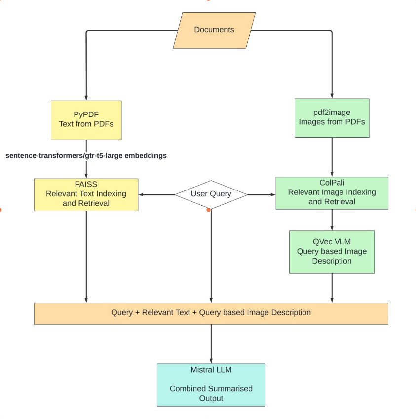
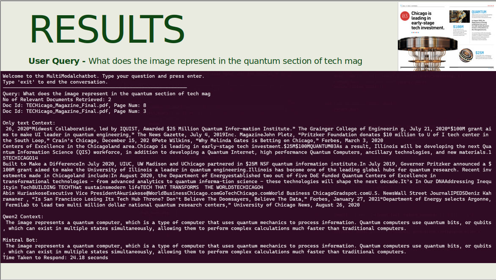

# RAG_Chatbot_Research_Project

Welcome to the RAG Chatbot Research Project repository! This project aims to create a RAG chatbot utilizing advanced Large Language Models (LLMs) and Vision Language Models (VLMs) to create a Retrieval-Augmented Generation (RAG) system. The repository includes all relevant code, datasets, and tools required for this research.

### Project Highlights
- Utilizes **GPUs** for accelerated processing.
- Recommended configuration: **15 GB RAM** and **15-20 GB of GPU shared memory** for optimal performance.

---
### Run terminal based Chatbot
Create a conda environment and Install all the dependencies using requirements.txt
```
pip install -r requirements.txt
```

In the script "_run_mistral.py_" adjust the folder path of pdf/text files and faiss store path

Run the script
```
python run_mistral.py
```

## 🗄️ Vector Database Architecture

The chatbot’s knowledge base was built from RAG texts, parsed and chunked into segments. You may insert all the pdfs that may be image based or text based in the pdf folder and create the vector indexing for reference using the following command

```sh
python RAG_Vector_Database/Dataset_to_Vector_Data_Conversion.py
```
This will create text based Vector Indexing in the **Vector_Data_Base_GTR_T5_Large** Folder.



## Run Inference on Combined Model
To run inference based on the creted Indexing make path changes in the combined.py and run the code using 
```sh
python combined.py
```


### Core Elements:
- **Document Parsing**: Split text and PDFs into 500-character chunks with a 50-character overlap.
- **Embeddings**: Generated using the `gtr-t5-large` model and stored in a FAISS vector database.

Files:
- `index.faiss`: Stores vector data.
- `index.pkl`: Metadata and configuration.

| **Parameter**              | **Value**     |
|----------------------------|---------------|
| Chunk Size                 | 500 characters|
| Overlap Size               | 50 characters |
| Embedding Model            | gtr-t5-large  |
| Computation Time           | 7,560 seconds |
| `index.faiss` Size         | 753 MB        |
| `index.pkl` Size           | 122 MB        |

---

## 🔄 Chatbot System Design

### 1. Base Model with RAG
Combines user query embeddings with the `FAISS` vector database for context-aware generation.

| Parameter      | Value    |
|----------------|----------|
| `do_sample`    | True     |
| `top_k`        | 1        |
| `temperature`  | 0.1      |
| `max_new_tokens` | 150   |

---

## 🌐 Web-Based Chatbot Interface

The project includes a web-based chatbot using **Flask** for the backend, enabling real-time interactions. The frontend, designed with HTML, CSS, and JavaScript, provides intuitive messaging functions.

---

### Run web-based Chatbot
```
python Chatbot/website_app/app.py
```

---

### Run Web-based Chatbot in Nexus Cluster
Run the command to launch the web interface in nexus
```
python Chatbot/website_app/app.py
```
Forward the port to your local system
```
ssh -L 5000:127.0.0.1:5000 username@ip-address
```
5000:127.0.0.1:5000, 5000 is the local system's port [you can change the port to whatever you want]

127.0.0.1:5000 is the remote machine's ip port on which flask is running

---

Additional libraries and tools:
- [LangChain](https://github.com/hwchase17/langchain)
- [FAISS](https://github.com/facebookresearch/faiss)
- [Flask](https://flask.palletsprojects.com/)

--- 

Thank you for exploring the RAG Chatbot Research Project!
